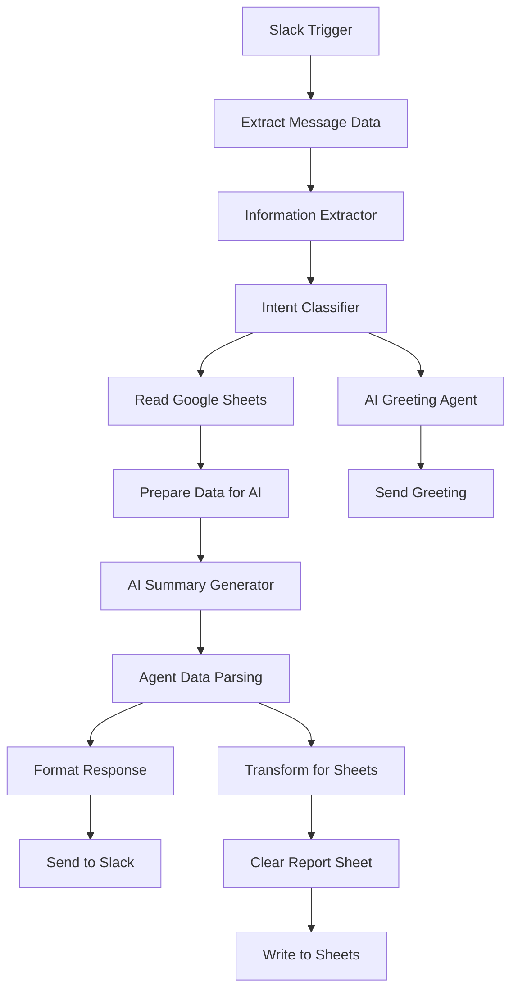

# HR Recruitment Slack Bot 🤖

An intelligent Slack bot built with n8n that helps HR teams search and filter candidates from a Google Sheets database using natural language queries.

## 📋 Overview

This workflow automates the recruitment process by allowing HR teams to:
- Search for candidates using natural language in Slack
- Filter candidates by skills, experience, salary, location, and notice period
- Get AI-powered candidate recommendations
- View detailed reports in Google Sheets
- Handle casual conversations and greetings

## ✨ Features

### 🔍 **Smart Candidate Search**
- Natural language processing for search queries
- Flexible salary matching (includes ranges and negotiable salaries)
- Experience level filtering with intelligent matching
- Skills-based candidate filtering
- Location and notice period constraints

### 🤝 **Conversational AI**
- Handles greetings and casual conversations
- Context-aware responses
- Memory buffer for conversation continuity
- Professional and friendly tone

### 📊 **Automated Reporting**
- Generates detailed candidate reports in Google Sheets
- Clears and updates report sheets automatically
- Provides direct links to view full reports
- Maintains search history and metadata

### 🎯 **Intent Classification**
- Automatically distinguishes between:
  - `candidate_search` - Active recruitment queries
  - `info_query` - General questions and greetings

## 🏗️ Architecture



## 🚀 Setup Instructions

### Prerequisites
- n8n instance (cloud or self-hosted)
- Slack workspace with bot permissions
- Google Workspace account
- Groq API account for AI models

### 1. Slack Configuration

1. Create a new Slack app in your workspace
2. Enable the following bot scopes:
   - `channels:read`
   - `chat:write`
   - `chat:write.public`
3. Install the app to your workspace
4. Note down the Bot User OAuth Token

### 2. Google Sheets Setup

1. Create a Google Sheets document with two sheets:
   - **HR Data**: Contains candidate information
   - **HR Logs**: For generated reports

2. **HR Data** sheet should have columns:
   ```
   Candidate Name | Experience | Skills | Current Salary | Expected Salary | 
   Notice Period | Location | CV Link | HR Remarks | Supervisor Remarks | 
   Projects | Interview Status | Interview Round 1 | Interview Round 2 | Final Status
   ```

3. Enable Google Sheets API and create service account credentials

### 3. Groq API Setup

1. Sign up for Groq API at [console.groq.com](https://console.groq.com)
2. Generate API key
3. Note the available models (workflow uses `llama-3.1-8b-instant` and `openai/gpt-oss-120b`)

### 4. n8n Workflow Import

1. Copy the workflow JSON from this repository
2. Import into your n8n instance
3. Configure the following credentials:
   - **Slack API**: Add your bot token
   - **Google Sheets OAuth2**: Connect your Google account
   - **Groq API**: Add your API key

### 5. Update Configuration

Update the following in the workflow:
- **Slack Channel ID**: Replace with your target channel ID
- **Google Sheets Document ID**: Replace with your sheets document ID
- **Sheet Names/IDs**: Update the sheet references

## 💬 Usage Examples

### Candidate Search Queries
```
"Find React developers with 3+ years experience"
"Show me Node.js candidates under 100K salary"
"Python developers in Lahore with 2+ years experience"
"Senior full-stack developers available in 30 days"
"Backend engineers with salary between 80K-120K"
```

### General Interactions
```
"Hi there!"
"Hello, how are you?"
"What can you help me with?"
```

## 🎛️ Workflow Components

### Core Nodes

| Node | Purpose | AI Model |
|------|---------|----------|
| **Slack Trigger** | Listens for messages in specified channel | - |
| **Information Extractor** | Extracts search parameters from text | GPT-OSS-120B |
| **Intent Classifier** | Determines user intent | Llama-3.1-8B |
| **AI Summary Generator** | Creates candidate summaries | GPT-OSS-120B |
| **AI Greeting Agent** | Handles casual conversations | Llama-3.1-8B |

### Data Processing
- **Extract Message Data**: Cleans and structures input
- **Prepare Data for AI**: Consolidates candidate database
- **Agent Data Parsing**: Processes AI responses
- **Transform**: Prepares data for Google Sheets

### Output Handling
- **Send Search Results**: Posts to Slack
- **Write Report to Sheet**: Updates Google Sheets
- **Clear Report Sheet**: Maintains clean reports

## 🔧 Configuration Options

### Salary Matching Logic
- Includes candidates with negotiable/TBD salaries
- Matches salary ranges where minimum meets criteria
- Uses practical HR recruiting logic vs strict computer logic

### Experience Matching
- "2+ years" = 2 years or more
- "Above 2 years" = more than 2 years
- Counts all relevant experience

### Response Style
- Friendly and conversational tone
- Leads with positive matches found
- Brief explanations with candidate highlights
- Human-like, not robotic responses

## 📊 Sample Response Format

```json
{
  "chatResponse": "Found 4 candidates with 2+ years experience under 200K budget:\n• **John Doe** - 3+ years React, 150K-180K salary\n• **Jane Smith** - 2.5 years Node.js, salary negotiable\n• **Mike Wilson** - 4+ years full-stack, starting at 160K\n\nAll have strong technical skills and are within your requirements!",
  "candidateData": [...],
  "metadata": {
    "totalMatches": 4,
    "totalCandidates": 50,
    "searchQuery": "React developers under 200K"
  }
}
```

## 🐛 Troubleshooting

### Common Issues

1. **Bot not responding**
   - Check Slack bot permissions
   - Verify channel ID in workflow
   - Ensure bot is added to the channel

2. **Google Sheets errors**
   - Verify OAuth2 credentials
   - Check sheet permissions
   - Confirm document and sheet IDs

3. **AI model errors**
   - Validate Groq API key
   - Check model availability
   - Review rate limits

### Debug Tips
- Enable workflow execution logging
- Check individual node outputs
- Verify data format between nodes
- Test with simple queries first

## 🤝 Contributing

1. Fork the repository
2. Create a feature branch
3. Make your changes
4. Test thoroughly
5. Submit a pull request

### Areas for Enhancement
- Add more sophisticated NLP processing
- Implement candidate ranking algorithms
- Add interview scheduling features
- Create analytics dashboard
- Support for multiple languages

## 📝 License

MIT License - feel free to use and modify for your needs.

## 🙏 Acknowledgments

- Built with [n8n](https://n8n.io) workflow automation
- Powered by [Groq](https://groq.com) AI models
- Integrates with Slack and Google Workspace

---

**Need help?** Open an issue or contribute to improve this workflow!
